# i3-quake-terminal
A companion script for [i3 window manager](https://i3wm.org/) to have a global drop-down windows toggleable by a configurable hotkey.


[pipes.sh](https://github.com/pipeseroni/pipes.sh) not included — it just shows restart after quitting (<kbd>q</kbd>) clearly.

The current name is legacy from the times the script only supported terminal windows.

# Installation
Just drop `quake-terminal.py` somewhere and [create a keybind](#hotkey-required) to launch it in your i3 config.

## Requirements
The following third party packages are required to run this script and must be installed:
- `i3ipc` ([PyPI](https://pypi.org/project/i3ipc/), [GitHub](https://github.com/altdesktop/i3ipc-python))
- `psutil` ([PyPI](https://pypi.org/project/psutil/), [GitHub](https://github.com/giampaolo/psutil))
- `Xlib` ([PyPI](https://pypi.org/project/python-xlib/), [GitHub](https://github.com/python-xlib/python-xlib))

Fellow Fedora enjoyers:  
`sudo dnf install python3-i3ipc python3-psutil python3-xlib`

For other distros, check your package manager repos, or install via `pip`.

# Usage
The script creates a single sticky window on specified output, toggleable via re-running the script with the same arguments — great for putting on a hotkey. The first call will show the window, the second call will hide it, and so on. If the window is closed instead of using the script to hide it, the first subsequent re-run will create and show a new one.

The script can be used to quickly access:
- Dropdown-like terminal window (the original use case, the script used to support terminal emulators only)
- Task manager
- Any other app you want to show and hide quickly:
- - Password manager
- - Music player
- - A solitaire game?
- - Anything else that creates a window ­— feel free to invent other uses!

>[!IMPORTANT]
>Please read at least the ["External command"](#external-command) section to learn how to use the script.

## i3 configuration
The script requires some configuration on i3's side to work properly.

### Hotkey (required)
Minimal configuration is to [add a keybind](https://i3wm.org/docs/userguide.html#keybindings) to launch the script.

Here's an example setting <kbd>Mod</kbd>+<kbd>\`</kbd> release to use the script with its [default settings](#default-settings) to manage a window of my favorite terminal emulator as seen on the demo image:
```
bindsym $mod+grave --release exec --no-startup-id /path/to/quake-terminal.py -- urxvt -title "The terminal" -e pipes.sh -p 4 -t 0 -r 5000
```
(note the `--` separator between (omitted) script options and the actual command to run, see ["External command"](#external-command))  
(the title is set to make it stand out from the other terminal windows, see next section)

### Anti-flickering (optional, but highly recommended)
To prevent windows appearing in default position and visibly teleporting to proper position when first created, add a [`for_window` rule](https://i3wm.org/docs/userguide.html#for_window) to the config to move it to the scratchpad on creation.

Continuing the example, an `urxvt` window called "The terminal" should have the following entry in i3 config:
```
for_window [class="URxvt" title="The terminal"] move scratchpad
```
Title filter skips all other `urxvt` windows not managed by the script. Title and class are only used to find the window on the first run; afterwards, they are tagged, and only the tag is used to manage it, so the title may be changed.

Adjust class and/or title as needed. Class names can be found using `xprop`.

>[!TIP]
>While the script will work without this setup, please do not skip it for a better experience.

# Configuration
The script accepts a set options to control the window's properties and behaviour. There are reasonable [default values](#default-settings), so the script will work out of the box with just a command to run an app.

## Available settings
Output of built-in help command:
```
$ quake-terminal.py -?
usage: quake-terminal.py [--width WIDTH | --relative-width WIDTH_RATIO] [--height HEIGHT | --relative-height HEIGHT_RATIO] [--horizontal {left,l,centre,center,c,middle,m,right,r}] [--vertical {top,t,centre,center,c,middle,m,bottom,b}] [--offset-horizontal OFFSET_X] [--offset-vertical OFFSET_Y] [--focus-first] [--timeout TIMEOUT] [--output OUTPUT]
                         [--version] [--help]

A script to have a window toggleable by a hotkey. Arguments not parsed as one of the script options below are used to construct the command to run. For best results, please use -- as the separator between script options and the command. This is mandatory if your command contains an argument with the same name as one of the script arguments.

options:
  --width, -w WIDTH     set the terminal window width, in pixels (default: 1280)
  --relative-width, -rw WIDTH_RATIO
                        set the terminal window width relative to the output width (default: None)
  --height, -h HEIGHT   set the terminal window height, in pixels (default: 720)
  --relative-height, -rh HEIGHT_RATIO
                        set the terminal window height relative to the output height (default: None)
  --horizontal, -x {left,l,centre,center,c,middle,m,right,r}
                        set the terminal window's horizontal align (default: centre)
  --vertical, -y {top,t,centre,center,c,middle,m,bottom,b}
                        set the terminal window's vertical align (default: top)
  --offset-horizontal, -oh, -ox OFFSET_X
                        horizontal offset for the terminal window, in pixels; positive values move to the right (default: 0)
  --offset-vertical, -ov, -oy OFFSET_Y
                        vertical offset for the terminal window, in pixels; positive values move down (default: 0)
  --focus-first, -f     if enabled, calling will focus unfocused visible terminal window instead of hiding it; focused terminal will be hidden (default: False)
  --timeout, -to TIMEOUT
                        amount of time in seconds to search for the created window before giving up, at least 0.1 (default: 1)
  --output, -o OUTPUT   set the terminal window's output. Use its name as it appears in xrandr (e.g. DP-2) or main for primary output (default: main)
  --version, -v         show program's version number and exit
  --help, -?            show this help message and exit

To prevent the window flickering, please add an i3 rule to move it to the scratchpad, e.g: "for_window [class="YourApp"] move scratchpad". See https://github.com/bnfour/i3-quake-terminal for more detailed help.
```

>[!NOTE]
>`-h` is used as a shorthand for `--height`, so the short version of `--help` is `-?`.

### External command
You also need to specify a command for the script to run. It should create a window that will be managed by the script.

Any arguments not recognized by argparse will be used to construct the command. `--` can be used to explicitly mark everything after it in as the command. This is the recommended and supported way to use this script (some commands may work without it, but you're on your own here).

The way to invoke the script is:
```
./quake-terminal.py [script options] -- command to run
```

>[!WARNING]
> The first instance of `--` is not used to construct the command. If you really need to run something literally named `--`, duplicate it in the script's command.

### Window sizing
The window size can be set either as an absolute pixel value or as a multiplier of output's size for either of axes.

`-w 960 -h 540` is equivalent to `-rw 0.5 -rh 0.5` for a 1920×1080 output. Absolute and relative sizes can be mixed, so `-w 960 -rh 0.5` (or vice versa) will also work.

### Window positioning
The window is anchored relatively to one of nine anchors of a display output, with an optional offset.

#### Output
To select an output to use, use its name (as reported by `xrandr --listmonitors`, e.g. "DP-0") with `--output`. Special "main" value is also accepted to use the output set as primary, regardless of its name.

>[!TIP]
>"main" is the default value for `--output`. It will be used if no other value is provided.

#### Anchoring
The nine anchors are all possible combinations of three vertical (top, middle, bottom) and horizontal (left, middle, bottom) anchors:

| -v ╲ -h | left | middle | right |
| ---: | :--- | :---: | ---: |
| top | 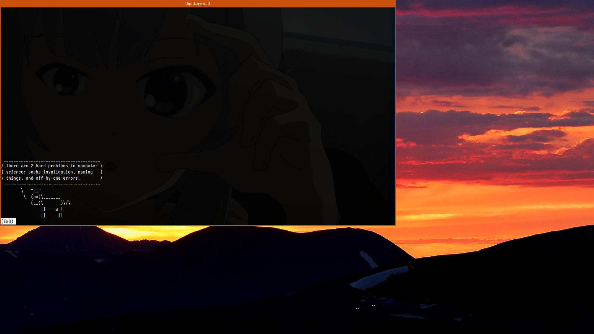 | 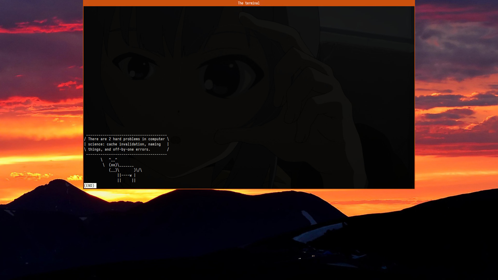 | 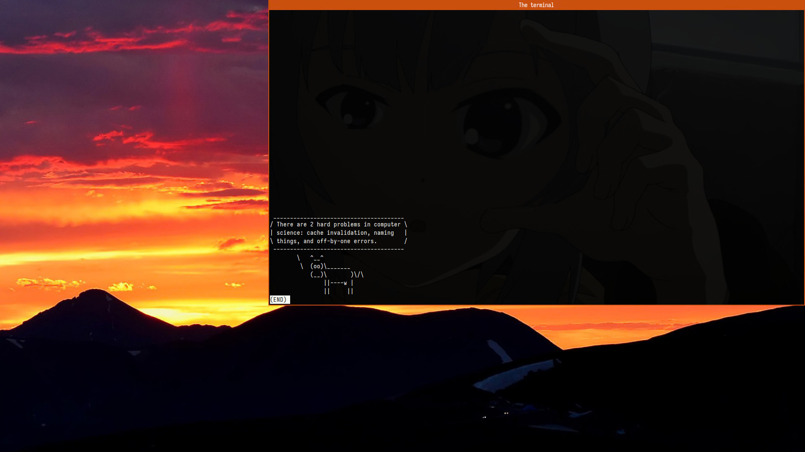 |
| middle | 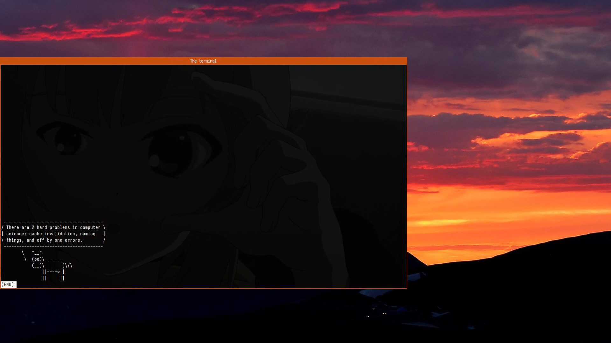 |  | 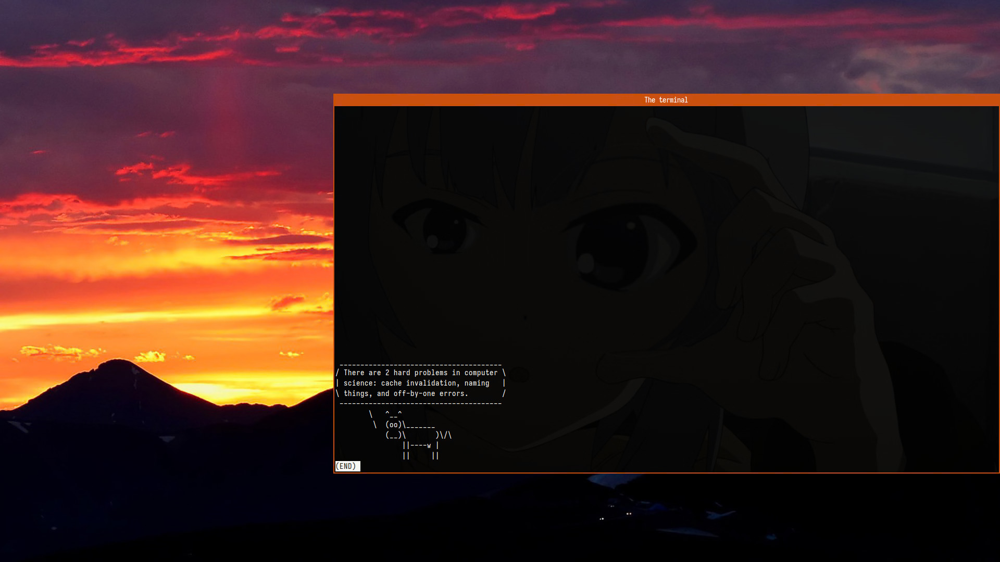 |
| bottom | 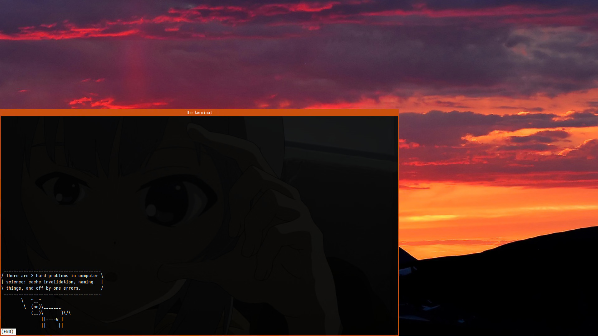 | 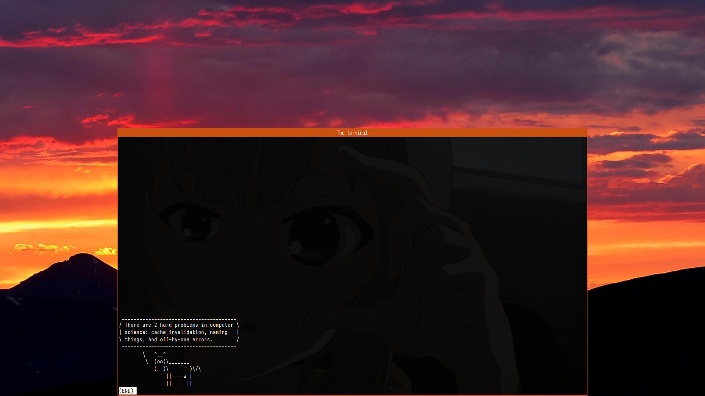 | 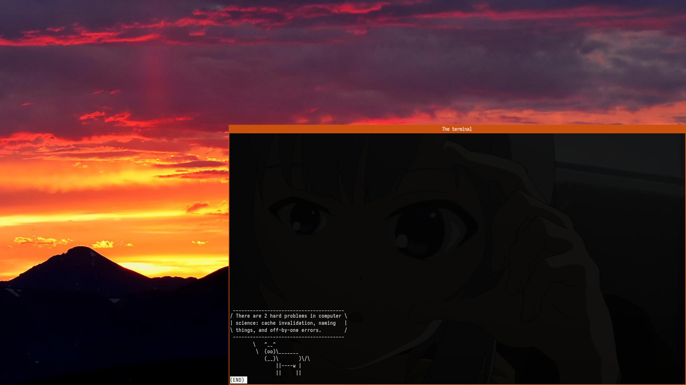 |

Left, right, top, and bottom anchors move the window so its border touches the relevant edge of the output, but does not go over it. Horizontal centering works like you would expect it to. Vertical centering is complicated (see the next table).

#### Offset
The window can be offset from the anchored position by a set amount of pixels on both axes. This can be used to emulate gaps, make the window not overlap with a bar, or just move it around for any other reason.

Positive X moves to the right, positive Y moves down:

| -oy ╲ -ox | -150 | 0 | 150 |
| ---: | :---: | :---: | :---: |
| -150 | 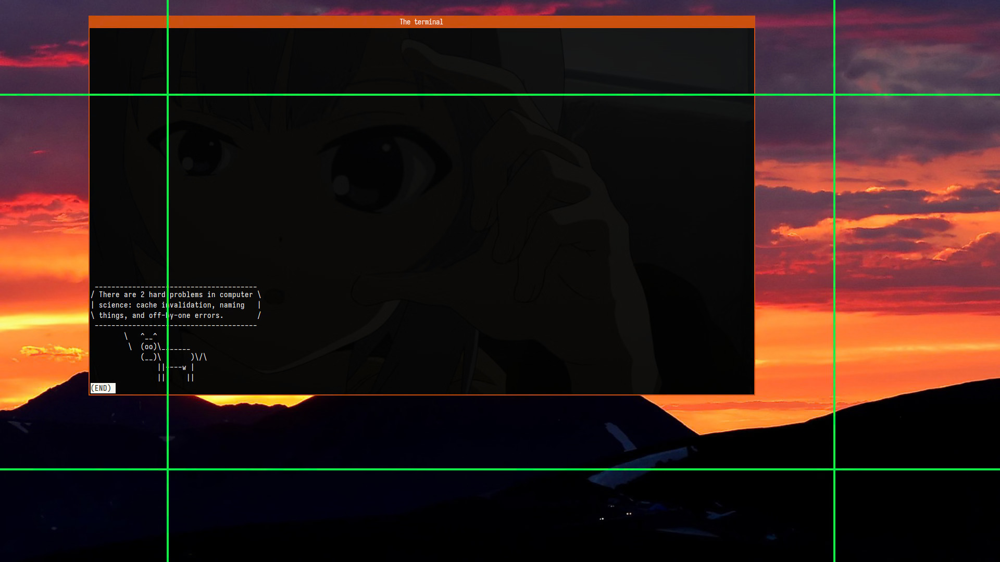 | 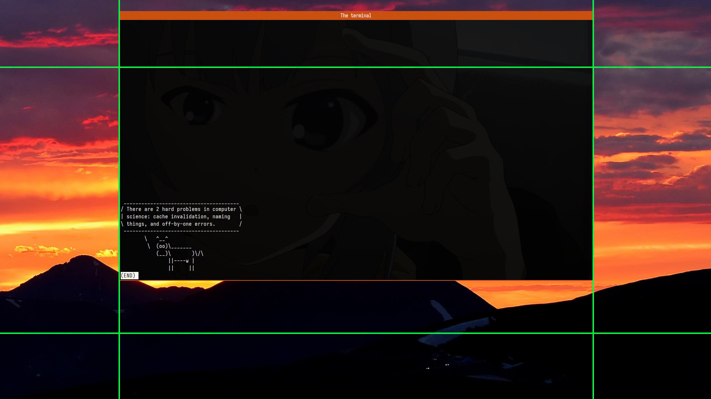 | 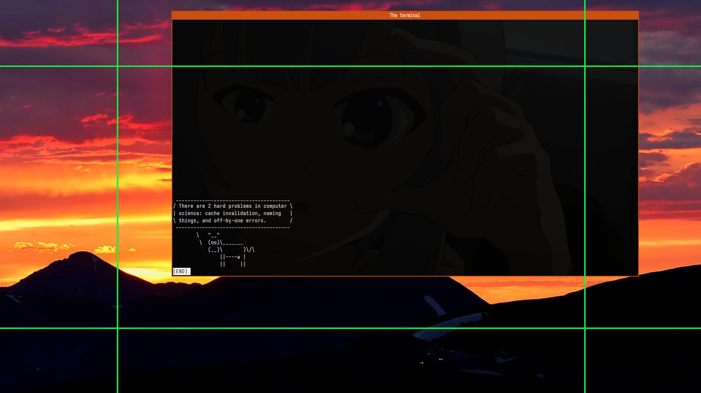 |
| 0 | 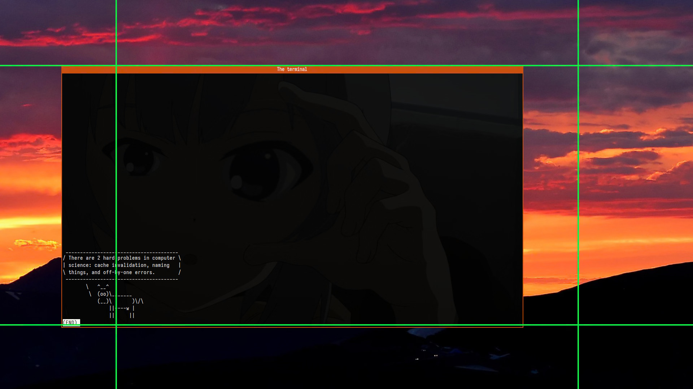 | 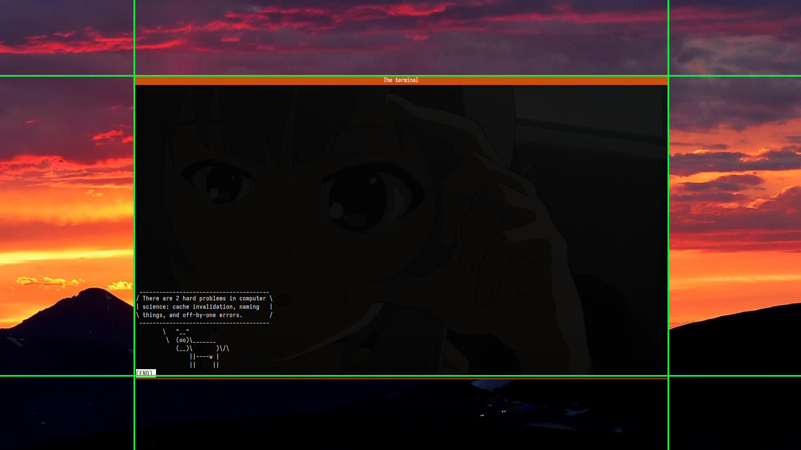 | 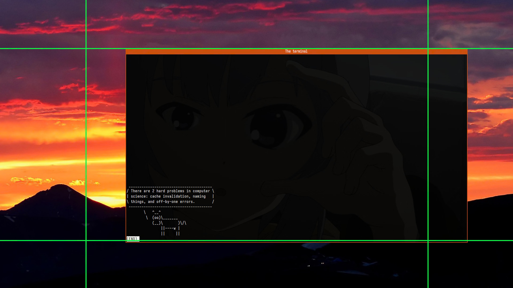 |
| 150 | 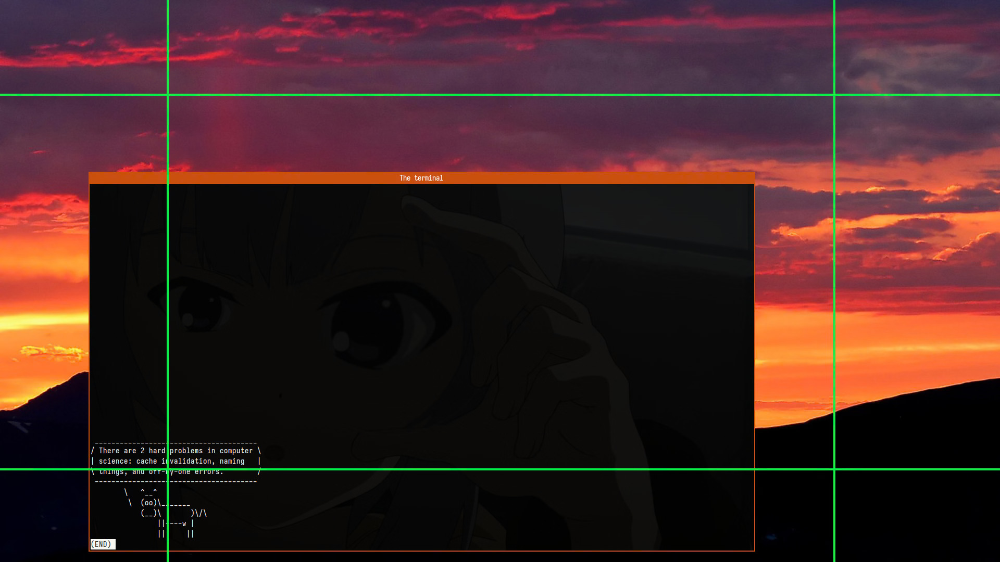 | 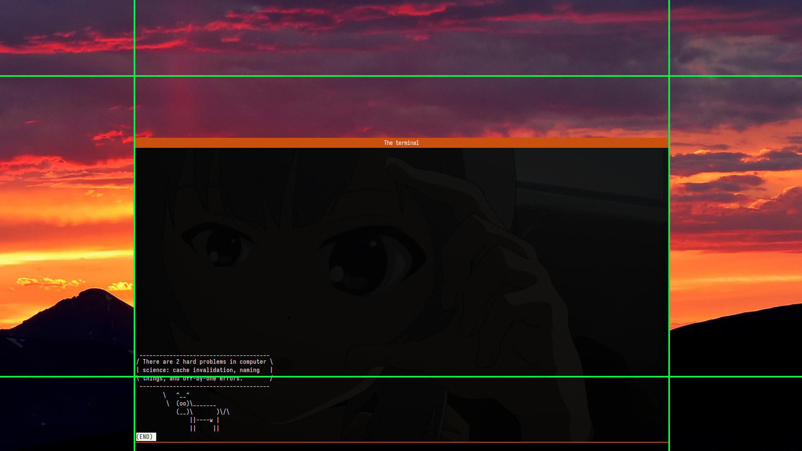 | 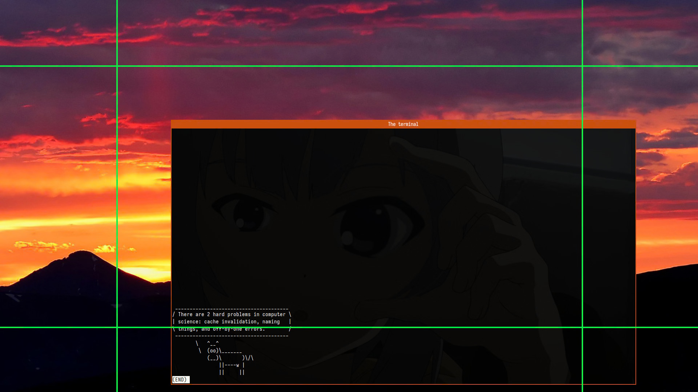 |

In these demo images:
- Both anchors are set to middle.
- The green grid is 1280×720 rect centered inside the full 1920×1080 screen.  
Its lines are 4px wide, so the inner 2px of lines are part of the inner rect.
- The actual window is slightly taller because of its header.  
It's positioned so that its top left corner _including the decorations_ is at the top left corner of a rect of the specified size _not including the decorations._ (I can't say I completely understand how window decorations work ¯\\\_(ツ)\_/¯)

The offsets can be used to move the window _anywhere_ from the anchor point, including any other output it's not anchored to.

### Other script options
Not related to window's size or position.

#### Focus behaviour
By default, invoking the script when the associated window is visible on the screen will hide it regardless of its status. With `--focus-first` (`-f`) set, the window will be focused if it had no focus, and another subsequent invocation will hide it (assuming the focus did not move).

#### Timeout
If an app takes a while to create a window, it may be necessary to extend the amount of time the script searches for a window to manage. The default value is 1 second. `--timeout` (`-to`) option can be used to set a custom timeout value greater or equal to 0.1 second (delay between window searches; the limit is there so it's done at least once).

### Default settings
With the default settings, the script creates a 1280×720px window in the top middle of the main output. You still need to [provide a command to run](#external-command).

# Inspiration
This script is inspired by https://github.com/NearHuscarl/i3-quake. If this script is not exactly what you're looking for, check it out as well!

# Images
The wallpaper is at least claimed to be an OC [in this reddit post](https://redd.it/3vv1c6).  
Terminal background image is Noël from Sora no Woto.

# History
This script went through the series of changes, from a quick and dirty prototype to a more robust and documented helper script. I still use it daily.

Here's the brief history by versioned releases.

## Version 1
July 2022.

The first version that is not even published here because it's very scuffed.

It had very limited support for launching apps: only `urxvt` was supported, and the only option to pass to it was `--background-expr`. You can also see just how small it was from 2.0's changelog.

## Version 2
June 2023–August 2025.

The public version. Generalization of the previous version to be useful outside of my setup. Still worked only with terminals (and only with `urxvt` out of the box).

### 2.0
June 2023.

Initial generalization rewrite (was 1.1 initially in my dotfiles, but promoted to a new major version due to the scale of the changes):
- Added short argument names (v1 only had long ones)
- Initial support for passing all unrecognized arguments to the terminal instead of a dedicated background argument
- Added `--name` option to set up the terminal title (it was hardcoded in version 1)
- Added `--terminal` option to optionally support terminals other than `urxvt`
- Added support for relative sizing
- Added offsets to window placement
- Better error handling (as opposed to "almost none" before)

### 2.1
July 2024.

Small bugfix because I accidentally noticed a lot of the same atoms on the window:
- no longer adds a new `_NET_WM_STATE_STICKY` atom to the window state every time the terminal is open

### 2.2
August 2025.

Another update where I just wanted to introduce typing, but ended up fixing other things:
- Introduced typing throughout the script
- Alternative names for the center anchor
- Fixed horizontal center and bottom anchors being off since the first release
- Better argument handling because I learned that `--` is a thing in argparse

## Version 3
September 2025–current.

The major update that supports any windows, not just terminal emulators.

### 3.0
October 2025.

- Support for arbitrary windows, the executable name is now required
- Removed `--terminal` option
- Removed `--name` option, the initial search is now done by pid instead
- Added `--timeout` option because some non-terminals took longer than 1 second to start during testing
- No longer errors on multiple windows matching the search criteria; this is still unsupported

# License
MIT
